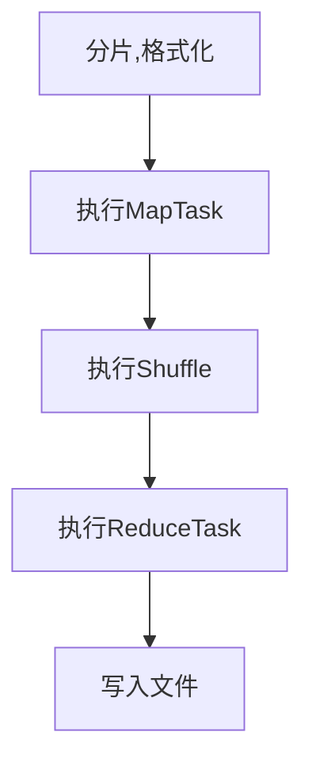

## mr过程

::: details answer

MapReduce的工作流程大致可以分为5步：

1. 分片、格式化数据

   **分片**：将输入源文件在逻辑上划分为大小相等的数据分片（split），Hadoop会为每一个分片启动一个MapTask，并由该任务执行自定义的map()函数

   **格式化操作**：将划分好的分片内容转换为可以作为map输入的<key,value>键值对。其中key代表偏移量，value代表每一行内容。

2. 执行MapTask

   **写入内存缓冲区**：每个Map任务都有一个内存缓冲区，输入的分片（split）数据经过Map任务处理后的中间结果写入内存（环形）缓冲区。

   **写入磁盘**：如果写入的数据达到内存缓冲的阈值，会启动一个线程将内存中的溢出数据写入磁盘，同时不影响Map中间结果继续写入缓冲区。

   **对key进行排序**：在溢写过程中，MapReduce框架会对key进行排序。

   **合并溢写文件**：如果中间结果比较大，会形成多个溢写文件，最后的缓冲区数据也会全部溢写入磁盘形成一个溢写文件，如果是多个溢写文件，则最后合并所有的溢写文件为一个文件。输出形式为<key,value>

3. 执行Shuffle过程

   将MapTask输出的处理结果数据分发给ReduceTask，并在分发的过程中，对数据按照key进行分区和排序，输出形式为<key,{value list}>

4. 执行ReduceTask

   输入ReduceTask的数据流是<key,{value list}>形式，用户可以自定义reduce()方法进行逻辑处理，最终以<key,value>的形式输出

5. 写入文件

   MapReduce框架自动将ReduceTask生成的<key,value>传入OutputFormat的write方法，实现文件写入。

:::

[(35条消息) 图文详解 MapReduce 工作流程_Shockang的博客-CSDN博客_mapreduce工作流程](https://blog.csdn.net/Shockang/article/details/117970151)

[图文详解 MapReduce 的工作流程 - 掘金 (juejin.cn)](https://juejin.cn/post/6996651554921005063)

[MapReduce的工作流程是怎样的？ (itheima.com)](http://www.itheima.com/news/20210415/141213.html)