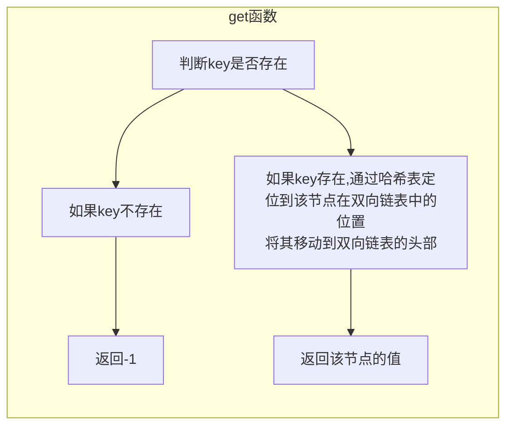
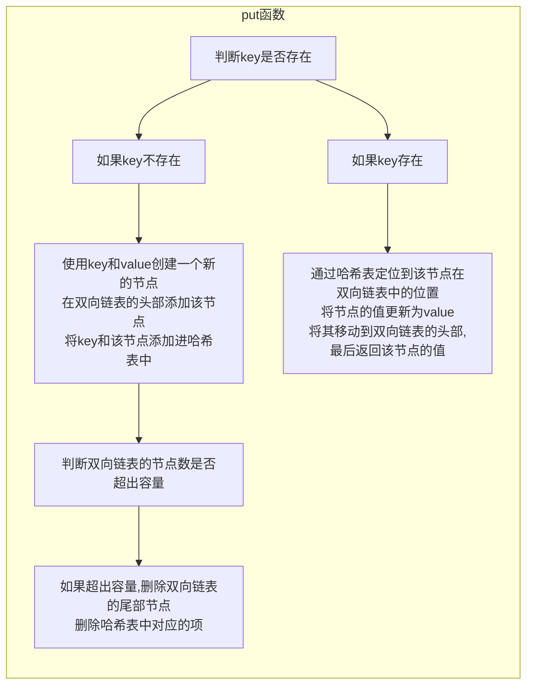

# 146.LRU缓存

https://leetcode-cn.com/problems/lru-cache/


## 方法一：哈希表+双向链表（C++实现）

### 思路分析

::: tip

用一个哈希表和一个双向链表维护所有在缓存中的键值对。

双向链表按照被使用的顺序存储了这些键值对，靠近头部的键值对是最近使用的，而靠近尾部的键值对是最久未使用的。

哈希表即为普通的哈希映射（HashMap），通过缓存数据的键映射到其在双向链表中的位置。





:::


### 参考代码

:::: code-group

::: code-group-item c++

```cpp
struct DLinkedNode {
    int key, value;
    DLinkedNode* prev;
    DLinkedNode* next;
    DLinkedNode(): key(0), value(0), prev(nullptr), next(nullptr) {}
    DLinkedNode(int _key, int _value) : key(_key), value(_value), prev(nullptr), next(nullptr) {}
};

class LRUCache {
private:
    unordered_map<int, DLinkedNode*> cache;
    DLinkedNode* head;
    DLinkedNode* tail;
    int size;
    int capacity;

public:
    LRUCache(int _capacity) : capacity(_capacity), size(0) {
        // 使用伪头部和伪尾部节点
        head = new DLinkedNode();
        tail = new DLinkedNode();
        head->next = tail;
        tail->prev = head;    
    }
    
    int get(int key) {
        if(!cache.count(key)){
            return -1;
        }
        // 如果key存在，先通过哈希表定位，再移到头部
        DLinkedNode* node = cache[key];
        moveToHead(node);
        return node->value;
    }
    
    void put(int key, int value) {
        if(!cache.count(key)){
            // 如果key不存在，创建一个新的节点
            DLinkedNode* node = new DLinkedNode(key, value);
            // 添加进哈希表
            cache[key] = node;
            // 添加至双向链表的头部
            addToHead(node);
            ++size;
            if(size > capacity){
                // 如果超过容量，删除双向链表的尾部节点
                DLinkedNode* removed = removeTail();
                // 删除哈希表中对应的项
                cache.erase(removed->key);
                // 防止内存泄露
                delete removed;
                --size;
            }
        }
        else{
            // 如果key存在，先通过哈希表定位，再修改value，并移到头部
            DLinkedNode* node = cache[key];
            node->value = value;
            moveToHead(node);
        }
    }
    // 将节点添加到链表头部
    void addToHead(DLinkedNode* node){
        node->prev = head;
        node->next = head->next;
        head->next->prev = node;
        head->next = node;
    }
    // 删除链表中的节点
    void removeNode(DLinkedNode* node){
        node->prev->next = node->next;
        node->next->prev = node->prev;
    }
    // 将链表中的节点移动到头部
    void moveToHead(DLinkedNode* node){
        removeNode(node);
        addToHead(node);
    }
    // 删除双向链表的尾部节点
    DLinkedNode* removeTail() {
        DLinkedNode* node = tail->prev;
        removeNode(node);
        return node;
    }
};
```

:::

::::

## 方法二：哈希表+双向链表（Java实现）

::: tip


:::

:::: code-group

::: code-group-item java

```java
// 自定义节点类
class Node {
    public int key, val;
    // 双向指针：next表示下一个，prev表示前一个
    public Node next, prev;
    public Node(int k, int v){
        this.key = k;
        this.val = v;
    }
}
// 自定义双向链表
class DoubleList{
    // 头尾虚节点
    private Node head, tail;
    // 链表元素数
    private int size;

    public DoubleList() {
        // 初始化双向链表的数据
        head = new Node(0, 0);
        tail = new Node(0, 0);
        head.next = tail;
        tail.prev = head;
        size = 0;
    }

    // 在链表尾部添加节点x,时间O(1)
    public void addLast(Node x) {
        // 设置插入节点的prev和next指针
        x.prev = tail.prev;
        x.next = tail;
        // 设置插入节点前一个节点的next指针
        tail.prev.next = x;
        // 设置尾节点的prev指针
        tail.prev = x;
        size++;
    }
    
    // 删除链表中的x节点(x一定存在)
    // 由于是双链表且给的是目标Node节点，时间O(1)
    public void remove(Node x){
        x.prev.next = x.next;
        x.next.prev = x.prev;
        size--;
    }

    // 删除链表中第一个节点，并返回该节点，时间O(1)
    public Node removeFirst(){
        if(head.next == tail){
            return null;
        }
        Node first = head.next;
        remove(first);
        return first;
    }

    // 返回链表长度，时间O(1)
    public int size(){
        return size;
    }
}
class LRUCache {
    int cap;
    LinkedHashMap<Integer, Integer> cache = new LinkedHashMap<>();
    public LRUCache(int capacity) { 
        this.cap = capacity;
    }

    public int get(int key) {
        if (!cache.containsKey(key)) {
            return -1;
        }
        // 将 key 变为最近使用
        makeRecently(key);
        return cache.get(key);
    }

    public void put(int key, int val) {
        if (cache.containsKey(key)) {
            // 修改 key 的值
            cache.put(key, val);
            // 将 key 变为最近使用
            makeRecently(key);
            return;
        }
        if (cache.size() >= this.cap) {
            // 链表头部就是最久未使用的 key
            // 删除最久未使用的元素
            int oldestKey = cache.keySet().iterator().next();
            cache.remove(oldestKey);
        }
        // 将新的 key 添加链表尾部
        // 添加为最近使用的元素
        cache.put(key, val);
    }

    private void makeRecently(int key) {
        int val = cache.get(key);
        // 删除 key，重新插入到队尾
        cache.remove(key);
        cache.put(key, val);
    }
}
```

:::

::::

## 参考文献

[LRU缓存机制 - LRU 缓存 - 力扣（LeetCode） (leetcode-cn.com)](https://leetcode-cn.com/problems/lru-cache/solution/lruhuan-cun-ji-zhi-by-leetcode-solution/)

[LRU 策略详解和实现 - LRU 缓存 - 力扣（LeetCode） (leetcode-cn.com)](https://leetcode-cn.com/problems/lru-cache/solution/lru-ce-lue-xiang-jie-he-shi-xian-by-labuladong/)

